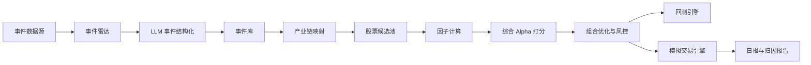

# 体育大事件事件驱动量化系统与中期实验设计

## 1. 项目定位

建议将项目题目升级为：

**体育大事件事件研究驱动的量化投资策略与自动交易系统：以 2026 世界杯为核心案例**

这样既保留世界杯主题，又回应老师关于事件频率过低的反馈。系统不再只押注一次世界杯，而是把世界杯、奥运会、欧洲杯、亚运会、重大赛事抽签、赛程公布、赞助官宣、门票开售、国家队名单发布等纳入统一事件库，形成可重复验证的事件驱动框架。

## 2. 核心假设

1. 体育大事件会带来注意力、消费、广告、彩票、转播、设备和周边商品需求的阶段性变化。
2. A 股市场对确定性大事件通常存在预热交易：赛前预期发酵，临近开幕或开幕后兑现。
3. 事件收益不是来自“知道世界杯会发生”，而是来自市场注意力、产业链暴露、价格动量和估值约束之间的动态错配。
4. LLM 不直接预测股价，而用于自动抽取事件、解释事件与公司的业务关系、给出可审计的产业链暴露证据。

## 3. 自动化系统架构

系统采用“自动运行 + 人工策略参数可修改”的半监督量化系统。



### 3.1 事件雷达

自动抓取或手工维护权威事件源：

- FIFA、IOC、AFC、UEFA 等赛事官网
- 百度指数、微信指数、Google Trends
- 财经新闻、公告、互动易、交易所公告
- 雪球、股吧、微博等讨论热度

事件表字段：

| 字段 | 含义 |
|---|---|
| event_id | 事件唯一编号 |
| event_name | 事件名称 |
| event_date | 事件兑现日 |
| event_type | 世界杯、奥运会、抽签、赞助、名单公布等 |
| certainty | 确定性评分，0-1 |
| impact | 影响力评分，0-1 |
| source_url | 权威来源 |
| update_time | 更新时间 |

### 3.2 LLM 模块

LLM 的角色是“信息理解器”和“解释生成器”，不是黑箱交易员。

输入：新闻、公告、赛事信息、公司业务介绍。  
输出：结构化 JSON。

```json
{
  "event": "2026 FIFA World Cup",
  "industries": ["体育营销", "显示设备", "彩票", "IP衍生品", "体育消费"],
  "stock_links": [
    {
      "ticker": "600060.SH",
      "company": "海信视像",
      "relation": "赛事赞助与显示设备消费",
      "evidence": "公司历史体育营销和显示设备主业相关",
      "confidence": 0.82
    }
  ],
  "risk_flags": ["临近开幕，可能已部分计价", "主题交易拥挤"]
}
```

为了避免 LLM 幻觉，所有公司关系必须满足至少一个硬证据：

- 上市公司公告或年报
- 官方赞助/授权/合作信息
- 主营业务与赛事消费链条直接匹配
- 历史赛事窗口中出现显著成交额或收益反应

## 4. Alpha 因子设计

综合打分不是拍脑袋权重，而是由因子计算得到。

### 4.1 事件吸引力因子

`EventScore = 0.4 * Certainty + 0.3 * Impact + 0.2 * TimeDecay + 0.1 * Novelty`

- Certainty：赛程、地点、主办方是否官方确认
- Impact：全球关注度、国内关注度、赛事规模
- TimeDecay：距离事件越近，预热因子越强，但开幕后快速衰减
- Novelty：是否有扩军、首次举办、时区友好、政策变化等新信息

### 4.2 舆情热度因子 POHI

`POHI_t = z(BaiduIndex) + z(NewsCount) + z(SocialPosts) + z(TurnoverRatio)`

核心不是绝对热度，而是热度变化率：

`POHI_Momentum = POHI_t - MA20(POHI_t)`

买入更关注从低位启动，卖出更关注高位拥挤。

### 4.3 公司事件暴露因子

`Exposure = 0.35 * BusinessRelevance + 0.25 * RevenueElasticity + 0.2 * EvidenceQuality + 0.2 * HistoricalReaction`

- BusinessRelevance：业务与世界杯链条的直接程度
- RevenueElasticity：赛事是否能带来订单、销量、广告、彩票或品牌转化
- EvidenceQuality：证据强度，公告 > 官网 > 财报 > 新闻 > 社媒
- HistoricalReaction：历史大型体育事件窗口中的 CAR 表现

### 4.4 价格与风险因子

`PriceScore = 0.4 * Momentum60 + 0.3 * VolumeBreakout + 0.3 * RelativeStrength`

`RiskPenalty = 0.35 * Volatility + 0.25 * Drawdown + 0.2 * ValuationCrowding + 0.2 * LiquidityRisk`

最终综合分：

`AlphaScore = 0.25 * EventScore + 0.25 * POHI_Momentum + 0.30 * Exposure + 0.20 * PriceScore - RiskPenalty`

## 5. 持仓权重生成

先用 AlphaScore 排名，再做风险预算约束。

原始权重：

`w_i_raw = max(AlphaScore_i, 0) / sum(max(AlphaScore_i, 0))`

风险调整：

`w_i = w_i_raw / Volatility_i`

约束条件：

- 事件策略总仓位不超过 40%-50%
- 单只股票不超过 10%-15%
- 单一行业不超过 25%
- 现金不低于 50%（当前已临近 2026 世界杯开幕，应降低追高风险）
- 若 20 日涨幅过高或 POHI 达到历史高位，自动降低目标仓位

## 6. 交易成本与市场约束

回测和模拟交易必须纳入真实市场约束：

- A 股普通股票 T+1，买入当天不能卖出
- 买入按 100 股整数手取整
- 普通主板涨跌停约 10%，ST 约 5%，科创板/创业板规则另行处理
- 佣金假设：双边 0.03%，最低 5 元可按券商规则设置
- 印花税：卖出单边 0.05%
- 滑点：按成交金额 0.05%-0.10%，主题股可设置更高
- 涨停无法买入、跌停无法卖出时，订单顺延或按失败处理

## 7. 回测实验设计

### 7.1 必须完成的一轮回测

中期最低要求可以设计为：

回测对象：2022 卡塔尔世界杯。  
事件日：2022-11-20。  
候选池：世界杯相关 A 股标的，包括显示设备、IP 衍生品、传媒彩票、体育消费、体育设施。  
基准：沪深 300、中证 1000、等权候选池。

事件窗口：

- T-120 至 T-60：潜伏期
- T-60 至 T-20：预热期
- T-20 至 T-5：拥挤期
- T-5 至 T+20：兑现期

交易规则：

1. 每日自动计算 POHI、Exposure、PriceScore、RiskPenalty。
2. 当 POHI_Momentum 突破阈值且 AlphaScore 排名前 5 时买入。
3. 组合持仓上限 50%，单股上限 15%。
4. 触发以下任一条件卖出：事件日前 5 个交易日、POHI 高位回落、组合回撤超过 8%、个股跌破成本 10%。

绩效指标：

- 累计收益
- 超额收益
- 年化波动率
- 夏普比率
- 最大回撤
- 胜率
- 换手率
- 交易成本
- 个股收益贡献
- 因子 IC 或分组收益

### 7.2 扩展实验

为了回应“世界杯频率低”，扩展事件池：

- 2018 俄罗斯世界杯
- 2022 卡塔尔世界杯
- 2024 欧洲杯
- 2024 巴黎奥运会
- 2026 世界杯抽签、赛程、门票、赞助等前置事件

每个事件用相同窗口和相同因子框架，比较平均 CAR、胜率和回撤。

## 8. 事件研究法

采用 MacKinlay 事件研究框架。

市场模型：

`R_i,t = alpha_i + beta_i * R_m,t + epsilon_i,t`

异常收益：

`AR_i,t = R_i,t - (alpha_i + beta_i * R_m,t)`

累计异常收益：

`CAR_i[t1,t2] = sum(AR_i,t)`

组合累计异常收益：

`CAR_portfolio = sum(w_i * CAR_i)`

这部分用于证明：体育事件是否真的带来超额收益，而不是简单跟随大盘上涨。

## 9. 2026 世界杯模拟交易配置

当前日期为 2026-05-27，距离 FIFA 官方赛程中 2026-06-11 开幕已很近，因此模拟交易应定位为“赛前最后预热窗口”，而不是 6 个月长期建仓。

建议模拟交易周期：

- 建仓观察：2026-05-27 至 2026-05-31
- 第一减仓：2026-06-03
- 第二减仓：2026-06-08
- 最终清仓：2026-06-10 或开幕日前一个交易日

模拟资金：100 万。  
事件策略仓位上限：40%。  
现金或低风险资产：60%。  

持仓权重不在 PPT 中手工写死，而是在答辩当天用最新数据跑模型生成。PPT 可以展示“权重生成逻辑”和“一次样例输出”。

样例输出格式：

| 股票 | Exposure | POHI | PriceScore | RiskPenalty | AlphaScore | 目标权重 | 配置理由 |
|---|---:|---:|---:|---:|---:|---:|---|
| 海信视像 | 0.82 | 0.64 | 0.55 | 0.22 | 0.58 | 10% | 赞助与显示设备主业相关，稳健暴露 |
| 元隆雅图 | 0.76 | 0.70 | 0.68 | 0.35 | 0.55 | 9% | IP 衍生品弹性强，但波动较高 |
| 粤传媒 | 0.60 | 0.75 | 0.62 | 0.42 | 0.47 | 7% | 传媒/彩票情绪暴露，高波动需限仓 |
| 共创草坪 | 0.58 | 0.48 | 0.50 | 0.25 | 0.39 | 5% | 体育设施链辅助暴露 |
| 舒华体育 | 0.52 | 0.45 | 0.46 | 0.30 | 0.33 | 4% | 体育消费相关，证据需补强 |

上表只是展示格式，真实中期汇报应使用最新行情与舆情数据自动计算。

## 10. 中期 PPT 应补充的页面

1. 老师反馈后的策略升级：从世界杯单事件到体育大事件事件库。
2. 自动化系统总架构图。
3. LLM 在系统中的位置：事件抽取、产业链映射、解释生成、风险标注。
4. 数据源与字段表。
5. AlphaScore 因子公式。
6. 持仓权重计算方法与约束条件。
7. 交易成本和 A 股交易规则。
8. 2022 世界杯回测净值曲线。
9. 事件研究 CAR 图。
10. 分窗口收益：T-120/T-60/T-20/T-5/T+20。
11. 个股贡献和回撤归因。
12. 2026 模拟交易配置与自动生成持仓表。
13. 后续结项复盘计划。

## 11. 可解释性创新点

传统事件驱动策略容易被质疑为“讲故事”。本项目可以把可解释性作为创新点：

1. 事件解释：每次交易都绑定 event_id 和权威来源。
2. 公司解释：每只股票都展示与事件的产业链关系和证据等级。
3. 因子解释：展示 AlphaScore 中各因子的贡献。
4. 风险解释：说明为什么某只股票被降权，例如波动率高、热度拥挤、估值过高。
5. 交易解释：每笔下单记录包含触发信号、目标权重、交易成本和约束检查。

最终系统不是“LLM 说买什么”，而是“LLM 帮助把非结构化事件变成可审计信号，再由量化模型自动生成组合”。

## 12. 权威依据

- MacKinlay, 1997, Event Studies in Economics and Finance.
- Edmans, García, Norli, 2007, Sports Sentiment and Stock Returns.
- Lopez-Lira and Tang, 2023/2024, Can ChatGPT Forecast Stock Price Movements?
- BloombergGPT, 2023, A Large Language Model for Finance.
- FinGPT, 2023, Open-Source Financial Large Language Models.
- Man AHL 系统化投资材料：强调跨市场、数据分析和系统化交易。
- 上海证券交易所交易机制说明：A 股涨跌停、交易单位等规则。
- FIFA 官方 2026 世界杯赛程：2026-06-11 至 2026-07-19。
