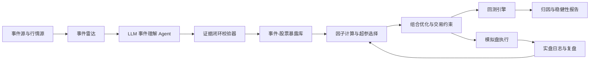
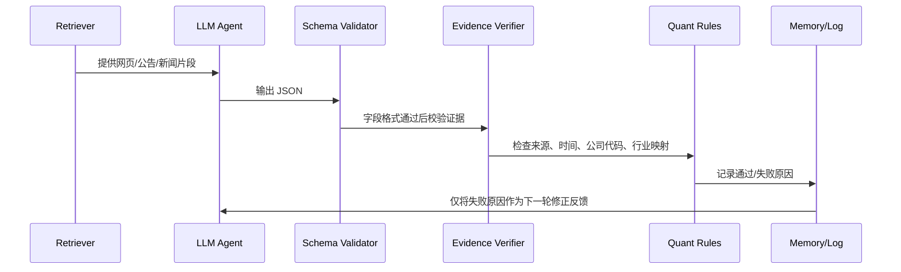

# 体育大事件事件驱动量化系统方案 v2：可实施版

## 0. 方案目标

本方案用于后续真实写代码、跑回测和接入模拟盘。项目主题保持为：

**体育大事件事件研究驱动的自动化量化投资策略与系统：以 2026 世界杯为核心模拟交易案例**

相比上一版，v2 做四个关键修正：

1. LLM 只做事件理解和证据抽取，必须通过闭环检验，不能直接给交易结论。
2. 因子必须有金融理论或实证文献支撑，不能随意拼接。
3. 所有超参数通过历史事件训练、walk-forward 和稳健性分析得到。
4. 2026-05-27 的模拟交易必须使用当日真实可见数据，冻结数据快照，避免回测超前信息。

## 1. 系统总架构

系统分为 7 层：



核心原则：

- 自动化：事件更新、因子计算、组合生成、订单生成、交易日志和归因自动完成。
- 可干预：研究者可以修改事件池、因子集合、超参空间和风控约束，但每次修改必须记录版本。
- 可审计：任何一笔交易都能回溯到事件、数据快照、因子贡献、LLM 证据和交易成本假设。
- 防超前：回测与模拟盘都必须采用 point-in-time 数据，任意时间点只能使用当时已经公开的信息。

## 2. 支持的体育大事件

系统不能绑定世界杯，而应支持通用体育事件类型。

事件类型：

| 类型 | 示例 | 事件日定义 |
|---|---|---|
| 正赛开幕 | 世界杯、奥运会、欧洲杯、亚运会 | 开幕日 |
| 抽签/分组 | 世界杯小组抽签、奥运会资格确认 | 官方公布日 |
| 赛程公布 | 比赛时间、举办城市、转播安排 | 官方发布日 |
| 门票/授权 | 门票开售、官方周边授权 | 公告日 |
| 赞助/合作 | 赞助商、转播商、合作伙伴公布 | 公告日 |
| 国家队节点 | 名单公布、晋级/淘汰 | 信息公布或比赛结束日 |

事件表字段：

| 字段 | 说明 |
|---|---|
| event_id | 事件唯一编号 |
| sport | 足球、篮球、综合赛事等 |
| event_name | 事件名称 |
| event_type | 开幕、抽签、赞助、门票等 |
| event_date | 事件兑现日 |
| announcement_date | 信息首次可知日期 |
| source_url | 官方或权威来源 |
| known_at | 系统首次入库时间 |
| certainty | 事件确定性，必须由规则计算 |
| impact_proxy | 影响力代理变量，如赛事等级、覆盖地区、历史热度 |

世界杯只是 2026-05-27 模拟盘的核心事件；回测必须补充其他体育事件以提高样本量。

## 3. LLM 模块与闭环检验

### 3.1 LLM 的职责边界

LLM 只允许输出以下内容：

1. 从新闻、公告、官网页面中抽取结构化事件。
2. 判断事件影响的产业链环节。
3. 抽取上市公司与事件的关系证据。
4. 生成可解释性文本。
5. 标记潜在风险，例如“蹭热点”“证据不足”“热度拥挤”。

LLM 不允许：

- 直接决定买入、卖出或目标收益。
- 直接覆盖数值因子。
- 在没有来源证据时生成公司关系。
- 使用训练语料中的记忆代替当前可检索证据。

### 3.2 Agent 闭环设计

参考 ReAct、CRITIC、Reflexion 等 Agent 思路，但在金融系统中做工具化约束：



闭环分为 5 道门：

| 门 | 检验内容 | 失败处理 |
|---|---|---|
| Schema Check | JSON 字段完整、类型正确、日期合法 | 重新生成 |
| Source Check | 每个关系必须有 source_url 和证据文本 | 证据不足则 confidence 降为 0 |
| Time Check | source 发布时间必须小于等于当前决策日 | 剔除，防超前 |
| Entity Check | 公司名、股票代码、主营业务和公告匹配 | 进入人工复核 |
| Quant Check | 只有通过校验的 Exposure 才进入因子库 | 不通过则不得参与下单 |

### 3.3 LLM 输出格式

```json
{
  "event_id": "FIFA_WC_2026_OPEN",
  "known_at": "2026-05-27 15:30:00",
  "event_name": "2026 FIFA World Cup",
  "event_type": "tournament_open",
  "industries": [
    {"name": "显示设备", "confidence": 0.83, "evidence_id": "ev_001"},
    {"name": "IP衍生品", "confidence": 0.71, "evidence_id": "ev_002"}
  ],
  "stock_links": [
    {
      "ticker": "600060.SH",
      "company": "海信视像",
      "relation_type": "sponsor_or_sports_marketing",
      "evidence_id": "ev_003",
      "confidence": 0.80,
      "risk_flags": ["临近开幕可能已部分计价"]
    }
  ]
}
```

证据表：

```json
{
  "evidence_id": "ev_003",
  "source_url": "https://...",
  "source_type": "official_website_or_company_filing",
  "published_at": "2026-05-20",
  "retrieved_at": "2026-05-27 15:20:00",
  "text_span_hash": "sha256:..."
}
```

### 3.4 LLM 模块评估指标

必须建立小型人工标注集。建议先标注 50-100 条事件-公司关系。

| 指标 | 计算方式 | 中期可展示 |
|---|---|---|
| 结构化通过率 | JSON schema 通过数量 / 总输出数量 | 是 |
| 证据支持率 | 有可验证来源的关系 / 总关系 | 是 |
| 幻觉率 | 无来源或来源不支持的关系 / 总关系 | 是 |
| 公司映射准确率 | 人工判定正确关系 / 样本关系 | 是 |
| 召回率 | 系统找到的真实关系 / 人工标注关系 | 可选 |
| 交易影响 | 有 LLM 暴露因子 vs 无 LLM 暴露因子的回测差异 | 结项展示 |

LLM 模块只有在证据支持率和公司映射准确率达到预设门槛后，才允许进入模拟盘的自动候选池。门槛本身不应拍脑袋，先用人工标注集统计分布，再设定为保守分位数，例如取验证集上 precision 明显稳定的 confidence 阈值。

## 4. 因子体系：只保留有理论支撑的因子

本系统采用“理论因子 + 事件特征 + 风险约束”的结构。因子不直接等同于权重，而是进入可解释模型或排序模型。

### 4.1 事件异常收益因子

理论来源：事件研究法。

市场模型：

`R_i,t = alpha_i + beta_i R_m,t + epsilon_i,t`

异常收益：

`AR_i,t = R_i,t - (alpha_i + beta_i R_m,t)`

累计异常收益：

`CAR_i[t1,t2] = sum(AR_i,t)`

用途：

- 衡量历史体育事件窗口中个股是否存在稳定异常收益。
- 作为 Exposure 的历史验证项。
- 作为回测结果的核心解释指标。

### 4.2 投资者注意力与情绪因子

理论来源：媒体情绪、投资者注意力、体育情绪影响资产价格。

可观测变量：

- 新闻数量
- 搜索指数
- 社媒讨论量
- 互动数
- 成交额和换手率变化

注意：不能直接用“热度越高越买”。应区分：

- 低位启动：可能是反应不足，适合买入。
- 极端拥挤：可能是过度反应，适合降权或退出。

实现方式：

`AttentionShock_i,t = z(Attention_t) - z(MA(Attention_t, L))`

其中 L 是超参数，通过训练得到。

### 4.3 动量因子

理论来源：Jegadeesh and Titman 的中短期动量，以及 Carhart 四因子模型中的动量。

实现方式：

- 20 日收益
- 60 日收益
- 相对行业收益
- 成交量确认后的趋势强度

注意：临近事件的短窗口交易不应机械套用 12-1 月动量，可将 20/60 日作为候选超参数，由 walk-forward 选择。

### 4.4 规模、价值与基本面控制

理论来源：Fama-French 三因子。

用途不是为了强行寻找长期价值股，而是做风险控制：

- 剔除极端高估值且无业绩支撑的纯概念股。
- 控制小市值壳股暴露。
- 避免回测收益只来自小盘风格，而不是体育事件。

可用变量：

- 市值分位数
- PB/PE 分位数
- 营收增长
- 赛事相关业务收入占比，如果年报可获得

### 4.5 流动性与交易成本因子

理论来源：流动性溢价与价格冲击。

可用变量：

- 日均成交额
- 换手率
- Amihud illiquidity：`abs(return) / amount`
- 涨跌停状态
- 停牌状态

用途：

- 控制模拟盘能否真实成交。
- 估计滑点。
- 对流动性差的股票降权。

## 5. 因子权重不是手设：用训练得到

上一版中类似 `0.25 * EventScore + 0.25 * POHI...` 的写法应删除。v2 改为数据驱动估计。

### 5.1 训练标签

每个样本为 `(event_id, stock_id, decision_date)`。

标签建议用未来事件窗口的净超额收益：

`y = FutureReturn[t, t+h] - BenchmarkReturn[t, t+h] - TradingCost`

也可以用分类标签：

`label = 1 if y > 0 else 0`

严禁使用 `t` 之后的信息构造特征。

### 5.2 模型选择

优先使用可解释模型：

1. RankIC 加权排序
2. Ridge / Lasso 线性模型
3. Logistic Regression
4. LightGBM 只作为扩展实验，必须配 SHAP 或特征贡献解释

中期建议使用 Ridge 或 RankIC 加权，原因是样本量有限、解释性强、过拟合风险低。

### 5.3 超参数空间

超参数必须先定义搜索空间，再训练选择。

| 超参数 | 候选范围 |
|---|---|
| attention_lookback | 5, 10, 20, 40 |
| momentum_lookback | 10, 20, 60 |
| event_entry_window | T-120, T-90, T-60, T-30 |
| event_exit_window | T-10, T-5, T-1, T+1 |
| top_k | 3, 5, 8 |
| max_position_per_stock | 5%, 10%, 15% |
| max_event_exposure | 20%, 30%, 40%, 50% |
| stop_loss | 5%, 8%, 10%, 12% |
| take_profit | 不设, 10%, 20%, trailing stop |
| slippage_rate | 0.05%, 0.10%, 0.20% |

候选范围可以调整，但必须在实验开始前写入配置文件，不能看完结果再改。

### 5.4 调参方法

采用事件级 walk-forward：

1. 用早期事件训练参数。
2. 在后续未见过的事件上测试。
3. 滚动窗口前移。
4. 汇总所有 out-of-sample 结果。

如果样本存在重叠事件窗口，采用 purged cross-validation 和 embargo，防止标签窗口重叠导致信息泄露。

选择参数不是选单次收益最高，而是选稳定区域：

- OOS 平均收益为正
- OOS 最大回撤可接受
- 参数邻域表现稳定
- 交易次数足够
- 扣成本后仍有效
- 换手率不过高

## 6. 组合构建与真实交易约束

### 6.1 组合优化目标

目标不是最大化毛收益，而是最大化预期净收益/风险：

`max w' mu - lambda * w' Sigma w - Cost(w, w_prev)`

约束：

- `sum(w_i) <= max_event_exposure`
- `0 <= w_i <= max_position_per_stock`
- 行业暴露不超过上限
- 股票必须非停牌、非一字涨停不可买
- 买入数量必须满足 A 股交易单位
- 现金比例满足模拟盘要求

### 6.2 交易成本模型

实际成交成本：

`TotalCost = Commission + StampTax + Slippage + MarketImpact`

建议设置：

- 佣金：按模拟券商实际费率；如果未知，先用双边 0.03%，最低 5 元。
- 印花税：卖出单边 0.05%。
- 滑点：按股票流动性分层设置，不统一拍脑袋。
- 冲击成本：可用成交金额占 ADV 比例估计。

流动性分层：

| 条件 | 滑点 |
|---|---|
| 日均成交额 > 10 亿 | 0.03%-0.05% |
| 1 亿-10 亿 | 0.05%-0.10% |
| < 1 亿 | 0.10%-0.30% 或禁止交易 |

### 6.3 A 股市场约束

回测与模拟盘必须支持：

- T+1 卖出限制
- 100 股整数手
- 涨跌停限制
- 停牌不可交易
- ST 股票特殊涨跌幅
- 科创板/创业板涨跌幅差异
- 当日无法成交订单顺延或取消

## 7. 回测实验设计

### 7.1 中期必须完成的一轮主回测

主回测：2022 卡塔尔世界杯。

事件日：2022-11-20。  
基准：沪深 300、中证 1000、体育/传媒/消费等相关行业指数。  
候选池：只允许使用在当时可由规则和证据识别出的股票。

回测流程：

1. 冻结历史数据版本。
2. 从事件日前逐日推进。
3. 每日只使用当日收盘前可见数据。
4. 计算 LLM 暴露因子时，证据发布时间必须早于决策日。
5. 生成目标组合。
6. 按下一交易日开盘或 VWAP 成交模拟，扣成本。
7. 记录所有订单、成交、失败原因。

报告指标：

- 毛收益和净收益
- 相对基准超额收益
- CAR/CAAR
- 最大回撤
- 夏普比率，但需说明短周期夏普不稳定
- 胜率
- 换手率
- 交易成本占收益比例
- 个股贡献
- 因子贡献

### 7.2 扩展回测事件

至少补充：

- 2018 俄罗斯世界杯
- 2022 卡塔尔世界杯
- 2024 欧洲杯
- 2024 巴黎奥运会
- 2026 世界杯抽签、赛程、门票或赞助相关事件

如果 A 股标的数据不足，可以把事件类型拆得更细，以增加样本量，而不是强行扩展到无关事件。

### 7.3 消融实验

为了证明系统设计有效，至少做 4 个版本：

| 版本 | 说明 |
|---|---|
| Baseline | 等权买入体育事件概念股 |
| No LLM | 不使用 LLM 暴露证据，只用行业分类 |
| No Attention | 删除注意力/热度因子 |
| Full Model | LLM 暴露 + 注意力 + 动量 + 风险约束 |

如果 Full Model 不能稳定优于 Baseline，也要诚实展示，说明策略目前只适合模拟验证或需要改进。

## 8. 2026-05-27 模拟盘方案

### 8.1 原则

模拟交易必须是系统在 **2026-05-27** 的真实输出，不能拿后续表现倒推配置。

必须冻结：

- 代码版本：git commit hash
- 配置版本：config hash
- 行情数据：截至 2026-05-27 15:00 的数据
- 新闻/公告/官网证据：retrieved_at <= 2026-05-27
- LLM 输出：保存原始 JSON
- 模型参数：只能来自 2026-05-27 之前的训练

### 8.2 当日运行流程

在 2026-05-27 收盘后运行：

1. 更新行情到 2026-05-27 收盘。
2. 更新事件库和证据库，所有来源必须记录 retrieved_at。
3. LLM 生成事件-股票关系。
4. 闭环校验器过滤无证据关系。
5. 使用已锁定模型计算 AlphaScore 或预测净超额收益。
6. 组合优化器生成目标权重。
7. 成本模型估计换仓成本。
8. 输出 2026-05-28 可执行模拟订单。
9. 在模拟盘提交订单或人工按订单录入。
10. 后续每日只记录实际表现，不回改 2026-05-27 信号。

### 8.3 模拟盘配置

账户初始资金：100 万。  
策略类型：A 股 long-only 体育事件驱动策略。  
事件：2026 FIFA World Cup 开幕前窗口。  
策略仓位上限：由历史 walk-forward 选出的 max_event_exposure 决定；如果尚未训练完成，中期前使用保守兜底上限 30%，并明确为风控兜底，不作为优化结果。  
现金：未使用资金保留现金。  
下单方式：次日开盘后限价或 VWAP 模拟。  
交易记录：每笔订单保存 signal_id、event_id、stock_id、target_weight、price、cost、status。

### 8.4 输出表格

中期汇报应展示真实系统输出表，而不是手写推荐权重：

| 字段 | 说明 |
|---|---|
| date | 2026-05-27 |
| ticker | 股票代码 |
| company | 公司 |
| event_id | 触发事件 |
| exposure_score | LLM 闭环后的事件暴露 |
| attention_score | 热度因子 |
| momentum_score | 动量因子 |
| liquidity_score | 流动性因子 |
| predicted_net_alpha | 模型预测扣成本超额收益 |
| target_weight | 优化器目标权重 |
| target_shares | 100 股取整后的股数 |
| expected_cost | 预计交易成本 |
| reject_reason | 若未买入，说明原因 |

## 9. 项目中期 PPT 建议结构

1. 项目定位升级：从世界杯单事件到体育大事件自动化事件驱动系统。
2. 中期要求对照表：已完成回测、已启动模拟盘、系统流程、配置理由。
3. 系统架构图。
4. 事件库设计和支持的体育事件类型。
5. LLM Agent 模块职责边界。
6. LLM 闭环检验：Schema、Source、Time、Entity、Quant 五道门。
7. 因子理论基础：事件研究、注意力/情绪、动量、Fama-French 控制、流动性。
8. 超参数训练方法：walk-forward、purged CV、稳定区域选择。
9. 回测设置：数据、事件、候选池、基准、成本。
10. 2022 世界杯主回测结果。
11. 扩展体育事件回测。
12. 消融实验。
13. 2026-05-27 模拟盘数据冻结说明。
14. 系统真实生成的 2026-05-28 订单表。
15. 模拟盘后续复盘计划。

## 10. 代码实现建议

目录结构：

```text
quant_sports_event/
  configs/
    strategy.yaml
    hyperparams.yaml
    cost_model.yaml
  data/
    raw/
    point_in_time/
    snapshots/
  event_agent/
    retrieve.py
    extract_llm.py
    validate_schema.py
    verify_evidence.py
  factors/
    event_study.py
    attention.py
    momentum.py
    liquidity.py
    fundamentals.py
  models/
    train.py
    predict.py
    walk_forward.py
  portfolio/
    optimizer.py
    constraints.py
    cost.py
  backtest/
    engine.py
    broker_sim.py
    metrics.py
  paper_trading/
    generate_orders.py
    blotter.py
    daily_report.py
  reports/
    midterm_report.ipynb
```

核心产物：

- `events.csv`
- `evidence.jsonl`
- `llm_outputs.jsonl`
- `validated_exposure.csv`
- `factor_panel.parquet`
- `walk_forward_results.csv`
- `backtest_trades.csv`
- `paper_orders_2026-05-28.csv`
- `paper_account_daily.csv`

## 11. 中期最低交付标准

必须完成：

1. 一轮 2022 世界杯完整回测。
2. 至少 3 个扩展体育事件的补充回测。
3. LLM 闭环校验器原型和人工标注小样本评估。
4. 超参数 walk-forward 或至少 train/validation/test 分离实验。
5. 含真实交易成本和 A 股约束的回测。
6. 2026-05-27 数据冻结和 2026-05-28 模拟订单生成。
7. 模拟盘每日净值、持仓和归因日志。

可以延后到结项：

- 大规模事件库。
- 更复杂的 LightGBM/SHAP 模型。
- 自动接入券商 API。
- 多市场或港股/美股体育标的扩展。

## 12. 关键参考

- MacKinlay, 1997, Event Studies in Economics and Finance.
- Edmans, García and Norli, 2007, Sports Sentiment and Stock Returns.
- Tetlock, 2007, Giving Content to Investor Sentiment.
- Jegadeesh and Titman, 1993, Returns to Buying Winners and Selling Losers.
- Fama and French, 1993, Common Risk Factors in the Returns on Stocks and Bonds.
- Carhart, 1997, On Persistence in Mutual Fund Performance.
- Amihud, 2002, Illiquidity and Stock Returns.
- Markowitz, 1952, Portfolio Selection.
- López de Prado, 2018, Advances in Financial Machine Learning.
- Yao et al., 2023, ReAct.
- Shinn et al., 2023, Reflexion.
- Gou et al., 2024, CRITIC.
- Huang et al., 2024, Large Language Models Cannot Self-Correct Reasoning Yet.
