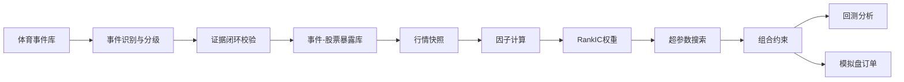

# 体育大事件事件驱动量化投资策略与系统

数据口径：2026-05-26 收盘快照  
模拟盘订单口径：2026-05-26 收盘后生成，2026-05-27 执行跟踪  
图表数据目录：`outputs/ppt/chart_data/`

说明：本文件按“每一页 PPT”组织，可直接复制到幻灯片中重新排版。每页包含页面标题、建议放在 PPT 上的文字、讲解逻辑和对应图表数据文件。

---

## 第 1 页｜封面

### 页面标题

体育大事件事件驱动量化投资策略与系统

### 页面副标题

以 2026 FIFA 世界杯为核心案例，构建可扩展、可回测、可模拟交易的自动化策略

### 页面文字

- 项目中期汇报
- 数据冻结日：2026-05-26 收盘后
- 核心案例：2026 FIFA 世界杯
- 扩展事件：2022 世界杯、2024 欧洲杯、2024 巴黎奥运会

### 讲稿提示

我们的主题仍然是世界杯事件驱动投资，但中期阶段不再只做“世界杯概念股分析”，而是把它放进一个更完整的体育大事件事件驱动系统中。这样既保留主题，又解决老师指出的事件频率不足问题。

---

## 第 2 页｜中期要求对照

### 页面标题

中期要求完成情况

### 页面文字

| 中期要求 | 本项目完成情况 |
|---|---|
| 至少一轮回测分析 | 已完成 2022 世界杯、2024 欧洲杯回测，并用巴黎奥运会做事件适配压力测试 |
| 开始模拟交易测试 | 已使用 2026-05-26 收盘真实数据生成 2026-05-27 模拟盘订单 |
| 策略基本思想 | 体育大事件带来的注意力扩散、产业链暴露与预期兑现 |
| 核心流程 | 事件库、证据闭环、因子评分、组合约束、回测、模拟盘 |
| 回测及结果分析 | 包含净收益、交易成本、CAAR、止损诊断和前向展开验证 |
| 模拟交易配置与理由 | 给出权重、股数、成本、市场约束和配置原因 |

### 建议图表

用“完成情况矩阵”或 6 个检查项卡片。

### 图表数据

`outputs/ppt/chart_data/chart_01_midterm_requirement_checklist.csv`

### 讲稿提示

这页先回应老师的硬性要求：我们已经有回测、有结果分析、有模拟交易配置，而且模拟盘不是回测数据里的事后配置，而是用 2026-05-26 已收盘数据生成。

---

## 第 3 页｜项目定位

### 页面标题

从“世界杯概念”到“体育大事件事件驱动”

### 页面文字

**核心问题：**  
当一个确定性体育大事件临近时，市场注意力、产业链暴露和价格行为是否会在事件兑现前形成可交易的异常收益？

**策略定位：**

- 不预测比赛结果
- 不追逐短期传闻
- 不让 LLM 直接推荐股票
- 用事件研究和量化因子，把体育事件转化为可检验的交易信号

**核心案例：**  
2026 FIFA 世界杯，因为时间确定、全球关注度高、产业链覆盖显示设备、体育运营、体育设施、IP 衍生品、传媒彩票等板块。

### 讲稿提示

这页要把主题讲稳：我们不是在做主观题材炒作，而是在研究一个事件驱动问题。世界杯是最典型、最容易解释的样本，但系统本身支持更多体育大事件。

---

## 第 4 页｜为什么不能只做世界杯

### 页面标题

事件频率问题：保留世界杯，扩展事件库

### 页面文字

老师指出的问题非常关键：世界杯四年一次，如果策略只依赖世界杯，事件频率太低，难以满足量化投资“可重复、可验证、可跟踪”的要求。

**本项目处理方式：**

| 层级 | 事件类型 | 作用 |
|---|---|---|
| 核心案例 | FIFA 世界杯 | 主题主线，展示完整事件驱动逻辑 |
| 同类扩展 | 欧洲杯、奥运会、亚运会 | 增加事件样本，检验规律是否稳定 |
| 高频补充 | 抽签、赛程公布、赞助官宣、门票销售 | 增加事件频率，支持后续自动化事件雷达 |
| 风险过滤 | 事件适配度不足的赛事 | 不强行交易，防止“有事件但无收益链条” |

### 讲稿提示

关键表达：我们没有改变主题，而是把世界杯作为体育大事件系统的核心案例。量化策略不能只靠一个故事，必须能在相似事件上反复验证。

---

## 第 5 页｜理论基础

### 页面标题

策略基本思想：预期差、注意力与事件研究

### 页面文字

**1. 预期差理论**  
股价反映的是市场对未来现金流和事件影响的预期。体育大事件临近时，如果市场尚未充分定价相关产业链受益，就可能出现预期修正。

**2. 投资者注意力**  
大型赛事会集中吸引媒体、消费者和投资者关注。注意力上升往往表现为新闻声量、搜索热度、社媒讨论和成交额冲击。

**3. 事件研究法**  
用市场模型估计正常收益，再计算异常收益 AR 和累计异常收益 CAR：

```text
AR_i,t = R_i,t - (alpha_i + beta_i * R_m,t)
CAR_i[t1,t2] = sum(AR_i,t)
```

**4. 交易纪律**  
如果事件前存在超额收益，而事件临近后出现“利好兑现”，策略应在事件开始前主动退出。

### 讲稿提示

这页面向金融老师：我们的依据是经典事件研究法和行为金融学，不是单纯看概念热度。后面的回测会验证“赛前布局、赛前退出”是否成立。

---

## 第 6 页｜策略核心假设

### 页面标题

三条可检验假设

### 页面文字

| 假设 | 金融含义 | 如何检验 |
|---|---|---|
| H1：赛前存在异常收益 | 体育大事件在兑现前会引发预期交易 | 事件研究 CAAR |
| H2：事件适配度决定交易价值 | 不是所有体育赛事都能映射到 A 股标的 | 事件适配门槛与止损诊断 |
| H3：注意力与价格动量共同影响收益 | 市场关注度上升后，价格可能继续反应不足 | 多因子评分与 RankIC 权重 |

### 页面重点

本项目不是先假设“世界杯概念股一定涨”，而是先定义可以被回测否证的假设，再用真实行情数据检验。

### 讲稿提示

这里可以强调“可证伪”。如果未来模拟盘表现不好，也可以回到这三条假设判断到底是事件不适配、注意力没有扩散，还是交易窗口选择不合理。

---

## 第 7 页｜系统核心流程

### 页面标题

自动化系统：从事件到订单

### 页面文字



### 页面重点

- 输入：体育事件、候选股票、行情数据、事件证据
- 处理：证据校验、因子计算、参数搜索、组合约束
- 输出：回测交易明细、事件研究结果、模拟盘订单

### 讲稿提示

这页讲“系统已经自动跑通”。我们可以人工判断策略方向，但真正生成因子、权重、回测、订单的流程应该是自动化的，避免主观挑选结果。

---

## 第 8 页｜LLM 与证据闭环

### 页面标题

LLM 只做信息结构化，不直接做交易决策

### 页面文字

**LLM/Agent 可参与的环节：**

- 抽取事件信息
- 识别产业链关系
- 整理公司与事件相关证据
- 输出结构化 JSON

**LLM/Agent 不允许做的事情：**

- 直接决定买卖
- 直接生成目标权重
- 使用决策日之后的信息
- 无来源地生成公司关系

**五道闭环校验：**

| 校验门 | 检查内容 |
|---|---|
| Schema Check | 字段完整、类型合法 |
| Source Check | 必须有来源和证据文本 |
| Time Check | 证据时间不得晚于决策日 |
| Entity Check | 股票代码、公司名、股票池匹配 |
| Quant Check | 通过风控后才能进入组合 |

**本次运行结果：**候选关系 10 条，通过 10 条，拒绝 0 条，幻觉代理率 0%。

### 图表数据

`outputs/ppt/chart_data/chart_16_validation_metrics.csv`

### 讲稿提示

老师之前担心 LLM 幻觉，这里要说清楚：LLM 不是“投资大师”，只是信息抽取工具。真正的买卖权重来自因子模型、回测和约束。

---

## 第 9 页｜因子设计

### 页面标题

因子不是拍脑袋：每个信号都有金融含义

### 页面文字

| 因子 | 当前权重 | 金融含义 |
|---|---:|---|
| 低波动 | 40.69% | 事件交易容易受情绪冲击，低波动约束可降低回撤 |
| 注意力 | 25.75% | 成交额冲击代表市场关注度升温 |
| 事件暴露 | 16.50% | 公司业务与体育事件产业链的相关性 |
| 动量 | 11.56% | 捕捉市场对事件信息的反应不足 |
| 流动性 | 5.50% | 保证组合能在真实市场成交 |

### 页面重点

因子权重不是人工设定，而是由训练样本的 RankIC 估计，并保留金融理论方向约束。

### 图表建议

画一个横向条形图：低波动、注意力、事件暴露、动量、流动性。

### 图表数据

`outputs/ppt/chart_data/chart_12_factor_weights.csv`

### 讲稿提示

注意这里不要把技术细节讲太深。可以说：模型会看历史上哪些因子更能解释后续收益，再把权重分配给这些因子。

---

## 第 10 页｜交易成本与市场约束

### 页面标题

回测必须像真实交易：成本、股数和仓位约束

### 页面文字

| 约束 | 设置 | 理由 |
|---|---|---|
| 交易方向 | 仅做多 | A 股普通股票模拟盘不使用做空 |
| 交易单位 | 100 股整数手 | 符合 A 股交易单位 |
| 单股上限 | 12% | 降低单一概念股风险 |
| 行业上限 | 25% | 防止组合集中在同一产业链环节 |
| 交易成本 | 佣金、印花税、滑点 | 避免回测收益虚高 |
| 数据时点 | 2026-05-26 收盘快照 | 防止模拟盘引入超前信息 |

### 页面重点

交易成本包括：

- 双边佣金：0.03%，最低 5 元
- 卖出印花税：0.05%
- 滑点：根据流动性分层估计 0.05%-0.20%

### 图表数据

`outputs/ppt/chart_data/chart_17_market_constraints.csv`

### 讲稿提示

中期汇报里这页很重要，因为项目要求模拟盘持仓要符合实际市场限制和标的特性。我们不是只算理论收益，而是把下单股数、成本和流动性都纳入了。

---

## 第 11 页｜实验设置

### 页面标题

回测设计：事件、股票池与交易窗口

### 页面文字

**回测事件：**

| 事件 | 事件日 | 用途 |
|---|---|---|
| 2022 FIFA 世界杯开幕 | 2022-11-20 | 核心历史案例 |
| 2024 欧洲杯开幕 | 2024-06-14 | 同类扩展验证 |
| 2024 巴黎奥运会开幕 | 2024-07-26 | 事件适配压力测试 |

**模拟交易事件：**

| 事件 | 事件日 | 决策日 |
|---|---|---|
| 2026 FIFA 世界杯开幕 | 2026-06-11 | 2026-05-26 收盘后 |

**候选股票池：**

海信视像、中体产业、共创草坪、舒华体育、元隆雅图、粤传媒、莱茵体育、力盛体育、金陵体育、奥拓电子。

### 页面重点

当前交易窗口由超参数搜索确定：T-60 入场，T-10 退出。模拟盘从 2026-05-26 收盘开始，是对真实当下的跟踪，不使用未来数据。

### 讲稿提示

这页要说明数据和事件口径。2026 世界杯按 FIFA 官方赛程从 2026-06-11 开始，所以 2026-05-26 已经处在赛前关键窗口。

---

## 第 12 页｜事件研究结果

### 页面标题

事件研究：收益主要出现在“赛前预热期”

### 页面文字

| 事件 | 赛前60至10日 CAAR | 赛前30至10日 CAAR | 开幕前后10日 CAAR |
|---|---:|---:|---:|
| 2022 世界杯 | +26.54% | +18.39% | -8.45% |
| 2024 欧洲杯 | +3.18% | -0.30% | -3.90% |
| 2024 巴黎奥运会 | -5.00% | +0.27% | +3.60% |

### 核心结论

- 2022 世界杯赛前异常收益显著，支持“事件预热期交易”逻辑。
- 欧洲杯赛前收益较弱但仍有正向窗口，说明同类赛事可以补充样本。
- 巴黎奥运会在 A 股体育候选池中的赛前适配度不足，不适合强行交易。
- 开幕前后窗口并不稳定，支持“赛前退出、避免利好兑现”的纪律。

### 图表建议

画分组柱状图：横轴为事件，颜色为三个窗口，纵轴为 CAAR。

### 图表数据

`outputs/ppt/chart_data/chart_02_event_study_caar.csv`

### 讲稿提示

这里是最金融的一页：用事件研究法证明我们的交易窗口不是主观想象。特别要强调“不是所有体育事件都交易”，巴黎奥运会的结果反而帮助我们建立过滤机制。

---

## 第 13 页｜回测结果总览

### 页面标题

当前中期系统回测表现

### 页面文字

| 指标 | 数值 | 解读 |
|---|---:|---|
| 回测净收益率 | 11.04% | 扣除佣金、印花税、滑点后的收益 |
| 交易笔数 | 6 笔 | 2022 世界杯、2024 欧洲杯各 3 笔 |
| 单笔平均毛收益率 | 18.26% | 未扣成本的平均价格涨幅 |
| 胜率 | 100.00% | 样本小，不能单独作为最终结论 |
| 总交易成本 | 2,530.06 元 | 成本/初始资金约 0.253% |

### 核心结论

在严格成本和交易单位约束下，策略仍获得 11.04% 净收益。由于事件样本仍有限，本结果应作为中期可行性验证，而不是最终收益承诺。

### 图表建议

左侧放 3 个 KPI：净收益、交易笔数、交易成本；右侧放解释文字。

### 图表数据

`outputs/ppt/chart_data/chart_03_backtest_kpi.csv`

### 讲稿提示

这页不要夸张年化收益。事件驱动策略的频率低，年化处理容易误导；中期更重要的是证明系统能自动产生交易，并在样本内给出合理结果。

---

## 第 14 页｜分事件与分标的贡献

### 页面标题

回测收益来自哪里？

### 页面文字

**分事件贡献：**

| 事件 | 交易笔数 | 净收益贡献 | 平均毛收益 |
|---|---:|---:|---:|
| 2022 世界杯 | 3 | +8.68% | +29.77% |
| 2024 欧洲杯 | 3 | +2.36% | +7.26% |

**代表性交易：**

| 事件 | 股票 | 买入日 | 卖出日 | 毛收益 |
|---|---|---|---|---:|
| 2022 世界杯 | 中体产业 | 2022-09-22 | 2022-11-11 | +29.15% |
| 2022 世界杯 | 海信视像 | 2022-09-22 | 2022-11-11 | +21.85% |
| 2022 世界杯 | 舒华体育 | 2022-09-22 | 2022-11-11 | +36.80% |
| 2024 欧洲杯 | 海信视像 | 2024-04-16 | 2024-06-05 | +8.13% |
| 2024 欧洲杯 | 中体产业 | 2024-04-16 | 2024-06-05 | +10.24% |
| 2024 欧洲杯 | 共创草坪 | 2024-04-16 | 2024-06-05 | +3.41% |

### 图表建议

用堆叠柱或瀑布图展示两个事件的净收益贡献；交易明细可放简表。

### 图表数据

`outputs/ppt/chart_data/chart_05_backtest_event_contribution.csv`  
`outputs/ppt/chart_data/chart_04_backtest_trade_detail.csv`

### 讲稿提示

这一页回答“收益是不是靠某一只股票偶然拉动”。目前看 2022 世界杯贡献更强，欧洲杯贡献较弱但仍为正，说明策略不是完全依赖单一标的。

---

## 第 15 页｜止损触发原因分析

### 页面标题

止损不是越严格越好：关键是事件适配和入场时点

### 页面文字

为了分析止损问题，我们设计了一个固定日历压力测试：机械地提前约 90 天入场、固定 8% 止损，并纳入巴黎奥运会样本。

| 框架 | 交易笔数 | 净收益率 | 止损笔数 | 止损率 |
|---|---:|---:|---:|---:|
| 固定日历压力测试 | 9 | +2.70% | 5 | 55.56% |
| 当前中期系统 | 6 | +11.04% | 0 | 0.00% |

**止损触发的主要原因：**

- 2022 世界杯：T-90 入场过早，价格还没有进入稳定预热期，容易被普通波动洗出。
- 2024 巴黎奥运会：A 股候选股票与事件的收益链条较弱，事件适配度不足。
- 固定 8% 止损忽略个股波动率差异，对高波动概念股过于机械。

**当前风控框架：**

- 事件适配度门槛：低于 0.7 不进入交易。
- 交易窗口：由超参数搜索选择 T-60 入场、T-10 退出。
- 动态止损：基础止损结合波动率倍数，避免被正常波动过早触发。

### 图表建议

左侧画止损率对比柱状图，右侧画三条原因解释。

### 图表数据

`outputs/ppt/chart_data/chart_08_stop_loss_diagnostic.csv`  
`outputs/ppt/chart_data/chart_09_strategy_risk_comparison.csv`

### 讲稿提示

这页的重点不是“没有止损就是好”，而是说明止损触发背后有结构性原因：入场太早、事件不适配、止损不考虑波动。风控应该先减少低质量交易，再用止损处理剩余风险。

---

## 第 16 页｜超参数与前向展开验证

### 页面标题

参数来自检验，而不是主观指定

### 页面文字

**超参数搜索范围：**  
系统共测试 128 组参数组合，核心参数包括注意力窗口、动量窗口、入场日、TopK、止损线、波动止损倍数、事件适配门槛、暴露门槛等。

**当前选择：**

| 参数 | 取值 | 含义 |
|---|---:|---|
| attention_lookback | 20 | 注意力冲击观察 20 日 |
| momentum_lookback | 20 | 中短期动量观察 20 日 |
| entry_days_before_event | 60 | 赛前 60 日进入 |
| exit_days_before_event | 10 | 赛前 10 日退出 |
| top_k | 3 | 每个事件最多选择 3 只 |
| min_event_fit_for_trade | 0.7 | 事件适配度门槛 |
| stop_vol_multiplier | 5.0 | 波动止损倍数 |

**前向展开验证结果：**

前向展开验证的含义是：只使用较早事件形成因子权重和参数选择，再把模型应用到之后发生的事件，尽量模拟真实投资中“先训练、后交易”的时间顺序，避免把未来信息提前放进模型。

| 指标 | 数值 |
|---|---:|
| 前向展开验证净收益率 | +2.30% |
| 交易笔数 | 3 笔 |
| 单笔平均毛收益率 | +7.26% |
| 交易成本 | 1,112.86 元 |

### 图表建议

用一张“Top10 参数组合表”和一张“前向展开验证 KPI 卡片”。

### 图表数据

`outputs/ppt/chart_data/chart_10_hyperparameter_top10.csv`  
`outputs/ppt/chart_data/chart_11_hyperparameter_sensitivity.csv`  
`outputs/ppt/chart_data/chart_06_walk_forward_kpi.csv`  
`outputs/ppt/chart_data/chart_07_walk_forward_trade_detail.csv`

### 讲稿提示

前向展开验证样本目前主要是 2024 欧洲杯，因此不能说模型已经充分泛化。但它至少说明：当模型只基于更早事件形成参数和权重，再应用到后续事件时，收益没有立即消失。这比单纯全样本回测更接近真实交易流程。

---

## 第 17 页｜模拟交易配置

### 页面标题

2026-05-26 收盘后的模拟盘订单

### 页面文字

**资金假设：** 初始资金 1,000,000 元  
**模拟盘目标仓位：** 18.09%  
**预估成交额：** 178,384.00 元  
**预估交易成本：** 219.11 元  
**订单日：** 2026-05-27

| 股票 | 行业 | Alpha评分 | 目标权重 | 股数 | 预估成交额 |
|---|---|---:|---:|---:|---:|
| 海信视像 | 显示设备 | 1.1629 | 12.00% | 4,400 | 117,920 元 |
| 共创草坪 | 体育设施 | 0.1704 | 3.50% | 800 | 34,888 元 |
| 中体产业 | 体育运营 | 0.1257 | 2.59% | 2,300 | 25,576 元 |

### 配置理由

- 海信视像：事件暴露和低波动贡献更高，且流动性充足，达到单股上限 12%。
- 共创草坪：体育设施链条与赛事建设相关，权重较小，用于分散产业链暴露。
- 中体产业：体育运营属性明确，但评分低于海信，给予较低仓位。

### 图表建议

用“模拟盘订单表 + 权重饼图/条形图”。

### 图表数据

`outputs/ppt/chart_data/chart_13_paper_orders.csv`  
`outputs/ppt/chart_data/chart_15_paper_order_summary.csv`  
`outputs/ppt/chart_data/chart_14_paper_scores_factor_contribution.csv`

### 讲稿提示

模拟盘不是假设我们已经从 T-60 持有到现在，而是从 2026-05-26 这个真实时间点开始跟踪。因为已经接近世界杯开幕，系统给出的总仓位只有 18.09%，比回测中的完整事件窗口更保守。

---

## 第 18 页｜模拟盘后续复盘计划

### 页面标题

结项汇报将如何复盘模拟交易

### 页面文字

**每日跟踪：**

- 实际成交价与参考收盘价偏差
- 持仓收益与沪深 300 / 中证 1000 对比
- 组合回撤、个股回撤、是否触发退出
- 事件热度和成交额冲击是否继续上升

**结项复盘问题：**

| 问题 | 复盘方式 |
|---|---|
| 模拟盘是否赚钱 | 真实持仓收益扣除成本 |
| 配置是否合理 | 对比各标的贡献与因子评分 |
| 是否过早或过晚入场 | 对照 T-60、T-30、T-10 事件窗口 |
| 风控是否有效 | 分析止损、回撤和退出纪律 |
| 事件频率是否足够 | 扩充欧洲杯、奥运会、亚运会等事件库 |

### 讲稿提示

这页要呼应中期要求：结项时需要回顾分析前面持仓配置的效果和原因。我们现在已经把需要跟踪的指标定义好了。

---

## 第 19 页｜阶段性结论

### 页面标题

阶段性结论：主题保留，系统扩展，交易可落地

### 页面文字

**1. 策略主题成立**  
世界杯仍是最清晰的核心案例，事件研究显示 2022 世界杯在赛前窗口存在明显异常收益。

**2. 单事件问题已被系统化处理**  
项目已从“世界杯单事件”扩展为“体育大事件事件库”，可加入欧洲杯、奥运会、亚运会、抽签、赛程发布、赞助官宣等事件。

**3. 自动化闭环已跑通**  
系统可以自动完成事件校验、因子评分、超参数搜索、回测、交易成本估计和模拟盘订单生成。

**4. 风控逻辑更加金融化**  
不再机械依赖固定止损，而是先过滤事件适配度，再结合波动止损、仓位上限和交易成本。

**5. 下一阶段重点**  
扩大事件样本、接入更丰富的注意力数据、持续跟踪 2026 世界杯模拟盘，并在结项汇报中复盘真实持仓表现。

### 讲稿提示

最后强调：我们的贡献不是证明“世界杯一定赚钱”，而是搭建了一个可解释、可检验、可扩展的体育事件驱动量化系统。

---

## 第 20 页｜附录：图表数据索引

### 页面标题

图表数据文件

### 页面文字

所有图表数据均已整理为 CSV，路径为：

`outputs/ppt/chart_data/`

建议重点使用：

| 文件 | 用途 |
|---|---|
| `chart_02_event_study_caar.csv` | 事件研究 CAAR 分组柱状图 |
| `chart_03_backtest_kpi.csv` | 回测绩效总览 |
| `chart_04_backtest_trade_detail.csv` | 交易明细表 |
| `chart_05_backtest_event_contribution.csv` | 分事件收益贡献 |
| `chart_09_strategy_risk_comparison.csv` | 止损压力测试对比 |
| `chart_12_factor_weights.csv` | 因子权重条形图 |
| `chart_13_paper_orders.csv` | 模拟盘订单表 |
| `chart_14_paper_scores_factor_contribution.csv` | 个股评分贡献拆解 |

完整索引见：

`outputs/ppt/chart_data/chart_00_index.csv`

---

## 第 21 页｜附录：参考依据

### 页面标题

主要参考依据

### 页面文字

- [MacKinlay, A. C. (1997). *Event Studies in Economics and Finance*. Journal of Economic Literature.](https://www.bu.edu/econ/files/2011/01/MacKinlay-1996-Event-Studies-in-Economics-and-Finance.pdf)
- [Edmans, García and Norli (2007). *Sports Sentiment and Stock Returns*. Journal of Finance.](https://leeds-faculty.colorado.edu/garcia/paper91v32.pdf)
- [Kaminski and Lo (2014). *When do stop-loss rules stop losses?* Journal of Financial Markets.](https://ideas.repec.org/a/eee/finmar/v18y2014icp234-254.html)
- [Moskowitz, Ooi and Pedersen (2012). *Time Series Momentum*. Journal of Financial Economics.](https://pages.stern.nyu.edu/~lpederse/papers/TimeSeriesMomentum.pdf)
- [Moreira and Muir (2017). *Volatility-Managed Portfolios*. Journal of Finance.](https://ideas.repec.org/a/bla/jfinan/v72y2017i4p1611-1644.html)
- [Yao et al. (2023). *ReAct: Synergizing Reasoning and Acting in Language Models*. ICLR.](https://openreview.net/forum?id=WE_vluYUL-X)
- [上海证券交易所交易机制说明。](https://english.sse.com.cn/start/trading/mechanism/)
- [FIFA World Cup 2026 官方赛程。](https://www.fifa.com/en/tournaments/mens/worldcup/canadamexicousa2026/articles/match-schedule-fixtures-results-teams-stadiums)

### 讲稿提示

这页可以不在正式汇报中详细讲，只作为答辩时回答“理论依据”和“规则依据”的备用页。
