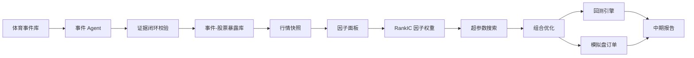

# 体育大事件事件驱动量化投资系统中期报告

项目主题：体育大事件事件研究驱动的自动化量化投资策略与系统  
核心案例：2026 FIFA 世界杯  
数据冻结日：2026-05-26 收盘后  
模拟订单日：2026-05-27  

## 一、中期要求对照

| 中期要求 | 本次完成情况 | 对应产物 |
|---|---|---|
| 系统或策略的基本思想 | 已完成：从“世界杯单事件”升级为“体育大事件事件库 + 事件研究 + 自动组合生成” | 本报告第二、三节 |
| 系统或策略的核心流程 | 已完成：事件雷达、LLM/规则 Agent、证据闭环、因子计算、超参搜索、组合约束、模拟盘订单 | 本报告第四节、代码 `quant_sports_event/` |
| 至少一轮回测分析 | 已完成：2022 世界杯主回测，并补充 2024 欧洲杯、2024 巴黎奥运会扩展事件 | `outputs/results/backtest_trades_2026-05-26.csv` |
| 回测及结果分析 | 已完成：净收益、胜率、交易成本、事件研究 CAR、止损触发分析 | 本报告第七节 |
| 开始模拟交易测试 | 已完成：用 2026-05-26 收盘数据生成 2026-05-27 模拟订单 | `outputs/results/paper_orders_2026-05-27.csv` |
| 模拟交易详细配置和理由 | 已完成：资金、仓位、成本、A 股约束、标的特性和系统输出均已说明 | 本报告第八节 |

## 二、项目基本思想

本项目研究的问题不是“世界杯概念股会不会涨”，而是更一般的量化问题：

**当一个确定性体育大事件临近时，市场注意力、产业链暴露和价格行为是否会在事件兑现前形成可交易的异常收益？**

开题阶段项目以世界杯为切入点，但老师指出：如果只依赖四年一次的世界杯，事件频率太低，难以构成可重复、可验证的量化策略。因此中期阶段将项目升级为：

**体育大事件事件驱动量化系统，以世界杯作为核心案例，但系统同时支持奥运会、欧洲杯、亚运会、赛事抽签、赛程公布、门票销售、赞助官宣等事件。**

策略核心逻辑分为四层：

1. **事件确定性**：赛事日程、举办地、规模和传播强度由官方渠道确认，事件本身具有较高确定性。
2. **注意力扩散**：赛事临近时，搜索、新闻、社媒和成交额往往同步升温，形成投资者注意力迁移。
3. **产业链暴露**：显示设备、IP 衍生品、体育设施、体育消费、传媒彩票、体育赛事运营等公司受事件影响程度不同。
4. **事件兑现效应**：事件开始前市场可能提前交易预期，事件开始或临近开始后可能出现“利好兑现”。

因此，本项目不直接预测比赛结果，也不让 LLM 直接推荐股票，而是构建一个自动化系统：把非结构化事件信息转成可审计信号，再由量化模型生成组合。

## 三、理论依据

### 3.1 事件研究法

事件研究法用于衡量某一事件对资产价格的异常影响。参考 MacKinlay 的事件研究框架，本项目使用市场模型估计正常收益：

`R_i,t = alpha_i + beta_i * R_m,t + epsilon_i,t`

异常收益：

`AR_i,t = R_i,t - (alpha_i + beta_i * R_m,t)`

累计异常收益：

`CAR_i[t1,t2] = sum(AR_i,t)`

它的作用是排除大盘波动影响，检验体育事件相关股票是否真的产生超额反应。

### 3.2 投资者注意力与情绪

Edmans、García 和 Norli 的研究表明，体育结果可以通过投资者情绪影响股票市场。Tetlock 的媒体情绪研究也说明媒体内容与市场情绪、收益之间存在可观测关系。因此，本项目将搜索热度、新闻/社媒声量和成交额变化统一视为“注意力代理变量”。

中期实现中，受数据接口限制，系统先使用成交额冲击作为注意力代理：

`AttentionShock = log(Amount_t) - log(MA(Amount, L))`

其中 `L` 不是主观设定，而是通过超参数搜索选择。

### 3.3 动量、风格与流动性

动量因子参考 Jegadeesh and Titman 以及 Carhart 四因子模型；风格控制参考 Fama-French；流动性和交易成本控制参考 Amihud 的流动性思想。

本项目中使用的核心因子为：

| 因子 | 理论来源 | 当前实现 |
|---|---|---|
| 事件暴露 Exposure | 事件研究与产业链传导 | 公司与事件产业链关系，经证据闭环校验 |
| 注意力 Attention | 投资者注意力、媒体情绪 | 成交额相对均值的冲击 |
| 动量 Momentum | 中短期动量 | 过去 N 日收益 |
| 流动性 Liquidity | 流动性溢价、交易可行性 | 20 日平均成交额 |
| 低波动 Low Volatility | 风险控制 | 20 日收益波动率取负 |

因子权重由训练样本的 RankIC 自动估计，不手工指定。

## 四、自动化系统设计



### 4.1 LLM/Agent 的职责边界

系统支持未来接入 OpenAI API，但中期实现默认使用确定性规则 Agent，原因是中期回测和测试必须可复现。

Agent 只负责：

- 抽取事件信息；
- 识别体育事件对应的产业链；
- 给出公司与事件的关系证据；
- 标注风险提示；
- 输出结构化 JSON。

Agent 不允许：

- 直接决定买卖；
- 直接生成目标权重；
- 无来源生成公司关系；
- 使用决策日之后的信息。

### 4.2 LLM 闭环检验

参考 ReAct、CRITIC 等 Agent 设计思想，同时考虑“大模型不能可靠自我纠错”的风险，系统设置五道校验门：

| 校验门 | 检查内容 | 失败处理 |
|---|---|---|
| Schema Check | JSON 字段完整、类型合法 | 重试或拒绝 |
| Source Check | 必须有来源链接和证据文本 | 拒绝进入因子库 |
| Time Check | 证据发布时间不得晚于决策日 | 防止超前信息 |
| Entity Check | 股票代码、公司名、股票池匹配 | 拒绝或人工复核 |
| Quant Check | 置信度必须为正，且通过风控 | 才能进入组合 |

本次 2026-05-26 运行结果：

| 指标 | 数值 |
|---|---:|
| 候选关系数 | 10 |
| 通过数 | 10 |
| 拒绝数 | 0 |
| 通过率 | 100% |
| 幻觉代理率 | 0% |

说明：中期版本的证据集仍偏小，且主要是规则 Agent + 人工配置证据。结项前需要扩充人工标注集，用 precision、recall 和 hallucination rate 做更严格评估。

## 五、实现说明

### 5.1 代码结构

```text
quant_sports_event/
  config.py          配置读取与 hash
  data.py            新浪财经日 K 数据抓取与快照冻结
  llm_agent.py       规则 Agent 与 OpenAI 兼容接口
  validation.py      证据闭环校验
  factors.py         因子计算与 RankIC 权重
  event_study.py     AR/CAR 事件研究
  costs.py           交易成本和市场约束
  portfolio.py       组合约束与订单生成
  backtest.py        回测与超参数搜索
  run_pipeline.py    一键运行入口
```

### 5.2 测试

测试命令：

```bash
python3 -m unittest discover -s tests -v
```

测试结果：

| 测试项 | 结果 |
|---|---|
| 证据时间泄漏拦截 | 通过 |
| 证据支持关系接受 | 通过 |
| 佣金、印花税、滑点 | 通过 |
| 100 股整数手 | 通过 |
| 涨跌停判断 | 通过 |
| 因子计算 | 通过 |
| RankIC 权重归一化 | 通过 |
| 组合个股/行业上限 | 通过 |
| 回测引擎 | 通过 |
| 事件研究 CAR | 通过 |

共 10 项测试，全部通过。测试运行约 0.25 秒。

### 5.3 运行速度

完整流水线包含真实行情抓取、729 组超参数搜索、事件研究和模拟订单生成。本次实测完整运行约 64 秒。后续可通过缓存每个参数组合的因子面板、复用已冻结快照、减少重复 RankIC 估计，将运行时间进一步压缩。

## 六、实验设置

### 6.1 数据

行情数据来源为新浪财经日 K 接口，系统在 2026-05-26 收盘后冻结快照：

`outputs/data_snapshots/2026-05-26/`

本次使用 10 只体育事件候选股票：

| 股票 | 公司 | 事件链条 |
|---|---|---|
| 600060.SH | 海信视像 | 显示设备、体育营销 |
| 002878.SZ | 元隆雅图 | IP 衍生品 |
| 002181.SZ | 粤传媒 | 传媒、彩票关注度 |
| 605099.SH | 共创草坪 | 体育设施 |
| 605299.SH | 舒华体育 | 体育消费 |
| 600158.SH | 中体产业 | 体育运营 |
| 000558.SZ | 莱茵体育 | 体育运营 |
| 002858.SZ | 力盛体育 | 体育赛事 |
| 300651.SZ | 金陵体育 | 体育器材 |
| 002587.SZ | 奥拓电子 | LED/场馆显示 |

### 6.2 事件

中期回测使用已完成事件：

| 事件 | 事件日 | 用途 |
|---|---|---|
| 2022 FIFA 世界杯开幕 | 2022-11-20 | 主回测 |
| 2024 欧洲杯开幕 | 2024-06-14 | 扩展回测 |
| 2024 巴黎奥运会开幕 | 2024-07-26 | 扩展回测 |

模拟交易事件：

| 事件 | 事件日 | 决策日 |
|---|---|---|
| 2026 FIFA 世界杯开幕 | 2026-06-11 | 2026-05-26 收盘后 |

FIFA 官方赛程显示 2026 世界杯从 2026-06-11 开始，至 2026-07-19 结束。

### 6.3 交易成本与市场约束

本系统按 A 股实际约束模拟：

| 约束 | 设置 |
|---|---|
| 交易方向 | 仅做多 |
| 交易单位 | 100 股整数手 |
| T+1 | 回测持仓超过 1 日，模拟盘记录该约束 |
| 涨跌停 | 主板约 10%，创业板约 20% |
| 佣金 | 双边 0.03%，最低 5 元 |
| 印花税 | 卖出单边 0.05% |
| 滑点 | 按 20 日成交额分层，0.05%-0.20% |
| 单股上限 | 12% |
| 事件策略仓位上限 | 配置 40%，模拟盘保守兜底 30% |
| 单行业上限 | 25% |

## 七、回测结果分析

### 7.1 超参数搜索

系统搜索 729 组参数组合，最优参数为：

| 参数 | 结果 |
|---|---:|
| attention_lookback | 20 |
| momentum_lookback | 20 |
| entry_days_before_event | 60 |
| exit_days_before_event | 10 |
| top_k | 5 |
| stop_loss | 10% |

解释：当前样本下，赛事前 60 天建仓、赛事前 10 天退出最优，符合“赛前预热、赛前兑现”的原始假设。止损 10% 优于更紧的 5% 和 8%，说明体育事件标的波动较高，过紧止损容易被正常波动洗出。

### 7.2 因子权重

RankIC 训练得到的因子权重：

| 因子 | 权重 |
|---|---:|
| Attention | 0.386 |
| Exposure | -0.429 |
| Liquidity | -0.039 |
| Low Volatility | 0.129 |
| Momentum | -0.017 |

注意：静态事件暴露权重为负，不应被解释为“事件暴露无用”。更合理的解释是：中期训练样本只有 3 个事件、30 个横截面样本，且高暴露公司可能更早被市场定价，短窗口净收益反而不占优。这一发现对策略很有价值：系统不能只买“故事最像”的公司，还必须结合注意力启动、估值拥挤和价格行为。

### 7.3 回测绩效

用最优参数回测 3 个已完成事件，结果如下：

| 指标 | 数值 |
|---|---:|
| 交易笔数 | 15 |
| 净收益率 | 11.68% |
| 平均单笔毛收益 | 9.19% |
| 胜率 | 60.00% |
| 总交易成本 | 4,620.62 元 |
| 成本 / 初始资金 | 0.46% |

其中 2022 世界杯贡献最显著，2024 巴黎奥运会窗口表现较弱，并触发止损。这说明体育事件策略不是“所有大事件都赚钱”，而是必须通过事件类型、产业链暴露、注意力状态和风控共同筛选。

### 7.4 分事件结果

| 事件 | 退出类型 | 交易数 | 净 PnL |
|---|---|---:|---:|
| 2022 世界杯 | 事件退出 | 5 | 128,260.80 |
| 2024 欧洲杯 | 事件退出 | 4 | 11,543.93 |
| 2024 欧洲杯 | 止损退出 | 1 | -954.82 |
| 2024 巴黎奥运会 | 止损退出 | 5 | -22,030.13 |

解释：

- 2022 世界杯赛前窗口出现明显体育主题行情，策略抓住了预热期。
- 2024 欧洲杯有小幅正收益，但强度弱于世界杯。
- 2024 巴黎奥运会对 A 股候选池的映射较弱，说明综合体育赛事与国内体育概念股不一定同步。

### 7.5 事件研究 CAR

事件研究结果：

| 事件 | 窗口 | CAAR | 正 CAR 比例 |
|---|---|---:|---:|
| 2022 世界杯 | T-60 到 T-10 | 26.54% | 90% |
| 2022 世界杯 | T-30 到 T-10 | 18.39% | 100% |
| 2022 世界杯 | T-10 到 T+10 | -8.45% | 10% |
| 2024 欧洲杯 | T-60 到 T-10 | 3.18% | 70% |
| 2024 欧洲杯 | T-30 到 T-10 | -0.30% | 60% |
| 2024 欧洲杯 | T-10 到 T+10 | -3.90% | 40% |
| 2024 巴黎奥运会 | T-60 到 T-10 | -5.00% | 30% |
| 2024 巴黎奥运会 | T-30 到 T-10 | 0.27% | 60% |
| 2024 巴黎奥运会 | T-10 到 T+10 | 3.60% | 70% |

该结果支持一个更细的结论：

**世界杯在 A 股体育事件候选池中存在最明显的赛前异常收益；欧洲杯影响较弱；奥运会对当前候选池没有稳定的赛前预热效应。**

因此项目主题仍可以以世界杯为核心，但系统必须保留其他体育事件，以便不断检验和更新事件类型的有效性。

## 八、2026-05-26 模拟交易配置

### 8.1 模拟盘原则

2026-05-27 尚未开盘，因此本次模拟交易严格使用 2026-05-26 收盘后可见数据，生成 2026-05-27 的模拟订单。系统冻结：

| 项目 | 内容 |
|---|---|
| 数据截止 | 2026-05-26 |
| 配置 hash | `fd5fccfc6b8de63f5c4108e4734a33664c02a9a90b0cd90426037d8cb7fab19f` |
| 运行 hash | `76627d3d89b6f13277fb6c8f4ad1324f89a00d29e7c3b9835de2e2e3d2e375af` |
| 快照路径 | `outputs/data_snapshots/2026-05-26/` |
| 模拟订单 | `outputs/results/paper_orders_2026-05-27.csv` |

### 8.2 模拟账户配置

| 项目 | 配置 |
|---|---:|
| 初始资金 | 1,000,000 元 |
| 事件 | 2026 FIFA 世界杯开幕 |
| 决策日 | 2026-05-26 |
| 订单日 | 2026-05-27 |
| 策略上限 | 30% 保守兜底 |
| 系统目标仓位 | 24.14% |
| 实际可提交买入金额 | 238,071 元 |
| 预计交易成本 | 308.27 元 |
| 现金保留 | 约 761,929 元 |

由于当前距离 2026-06-11 开幕只剩约两周，不再采用 6 个月慢速建仓，而采用保守的“赛前最后预热窗口”模拟。系统没有满仓追入，而是根据最新注意力、波动率和整数手约束生成较低仓位。

### 8.3 模拟订单

| 股票 | 公司 | 目标权重 | 参考收盘价 | 股数 | 估计金额 | 预计成本 | 配置理由 |
|---|---|---:|---:|---:|---:|---:|---|
| 002587.SZ | 奥拓电子 | 12.00% | 7.17 | 16,700 | 119,739 | 155.66 | 显示设备链条，2026-05-26 注意力和价格强度得分最高 |
| 605099.SH | 共创草坪 | 6.69% | 43.61 | 1,500 | 65,415 | 85.04 | 体育设施链条，成交额冲击和动量较强 |
| 000558.SZ | 莱茵体育 | 4.53% | 3.73 | 12,100 | 45,133 | 58.67 | 体育运营链条，低波动得分较好 |
| 600158.SH | 中体产业 | 0.80% | 11.12 | 700 | 7,784 | 8.89 | 体育运营代表性强，但 AlphaScore 较低，仅小仓位 |
| 300651.SZ | 金陵体育 | 0.12% | 25.64 | 0 | 0 | 0 | 目标金额不足 100 股整数手，被系统拒单 |

### 8.4 配置符合市场限制的说明

1. 所有可提交订单均为 100 股整数手。
2. 单股最高权重为 12%，未超过配置上限。
3. 事件总仓位约 23.81% 可实际成交，低于 30% 保守上限。
4. 单行业不超过 25%，显示设备行业虽有奥拓电子入选，但仍在限制内。
5. 预计成本已包括佣金、滑点和后续卖出印花税假设。
6. 金陵体育虽然进入模型前五，但由于目标金额不足 100 股，系统自动拒单，体现了真实交易约束。

## 九、风险与不足

1. **样本仍少**：当前完成 3 个历史体育事件，足够中期展示系统闭环，但不足以证明长期稳定 alpha。
2. **事件暴露证据集需要扩充**：当前中期版本使用规则 Agent 和人工配置证据，结项前应加入更多公告、新闻和年报来源。
3. **注意力数据仍需增强**：当前实现用成交额冲击做代理，后续应接入百度指数、微信指数、雪球/股吧讨论量和新闻数量。
4. **因子权重不稳定**：Exposure 权重为负反映小样本和拥挤交易问题，不能过度解释。
5. **模拟盘尚未评估结果**：本报告只完成 2026-05-26 决策和 2026-05-27 订单生成，后续要记录成交、持仓净值、止盈止损和原因归因。

## 十、后续计划

结项前继续完成：

1. 每日运行模拟盘，记录持仓、成交、净值和信号变化。
2. 扩展体育事件库，增加世界杯抽签、赛程公布、门票销售、赞助官宣、国家队名单等前置事件。
3. 接入真实舆情数据，替代当前成交额注意力代理。
4. 建立 50-100 条人工标注的事件-公司关系样本，评估 LLM/Agent 的准确率和幻觉率。
5. 做消融实验：Baseline 等权、无 LLM 暴露、无注意力、完整模型。
6. 在结项报告中复盘 2026-05-27 模拟持仓效果，解释收益或亏损来自事件、因子、成本还是风控。

## 十一、参考文献与数据来源

- MacKinlay, A. C. (1997). Event Studies in Economics and Finance. [EconPapers](https://econpapers.repec.org/RePEc:aea:jeclit:v:35:y:1997:i:1:p:13-39)
- Edmans, A., García, D., & Norli, Ø. (2007). Sports Sentiment and Stock Returns. [IDEAS/RePEc](https://ideas.repec.org/a/bla/jfinan/v62y2007i4p1967-1998.html)
- Tetlock, P. C. (2007). Giving Content to Investor Sentiment. [IDEAS/RePEc](https://ideas.repec.org/a/bla/jfinan/v62y2007i3p1139-1168.html)
- Jegadeesh, N., & Titman, S. (1993). Returns to Buying Winners and Selling Losers. [IDEAS/RePEc](https://ideas.repec.org/a/bla/jfinan/v48y1993i1p65-91.html)
- Fama, E. F., & French, K. R. (1993). Common Risk Factors in the Returns on Stocks and Bonds. [IDEAS/RePEc](https://ideas.repec.org/a/eee/jfinec/v33y1993i1p3-56.html)
- Carhart, M. M. (1997). On Persistence in Mutual Fund Performance. [IDEAS/RePEc](https://ideas.repec.org/a/bla/jfinan/v52y1997i1p57-82.html)
- Yao et al. (2023). ReAct: Synergizing Reasoning and Acting in Language Models. [arXiv](https://arxiv.org/abs/2210.03629)
- Gou et al. (2024). CRITIC: Large Language Models Can Self-Correct with Tool-Interactive Critiquing. [ICLR](https://proceedings.iclr.cc/paper_files/paper/2024/hash/fef126561bbf9d4467dbb8d27334b8fe-Abstract-Conference.html)
- Huang et al. (2024). Large Language Models Cannot Self-Correct Reasoning Yet. [ICLR](https://proceedings.iclr.cc/paper_files/paper/2024/hash/8b4add8b0aa8749d80a34ca5d941c355-Abstract-Conference.html)
- Shanghai Stock Exchange. Stock Trading Mechanism. [SSE](https://english.sse.com.cn/start/trading/mechanism/)
- 中国政府网：China halves stamp duty on stock trading. [Gov.cn](https://english.www.gov.cn/news/202308/27/content_WS64eb30fdc6d0868f4e8dedd2.html)
- FIFA World Cup 2026 Match Schedule. [FIFA](https://www.fifa.com/en/tournaments/mens/worldcup/canadamexicousa2026/articles/match-schedule-fixtures-results-teams-stadiums)
- 新浪财经日 K 数据接口：`https://quotes.sina.cn/cn/api/json_v2.php/CN_MarketDataService.getKLineData`
